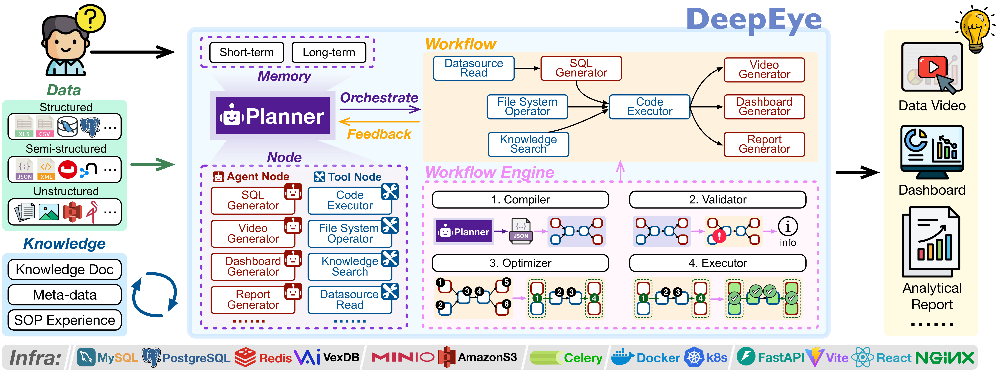
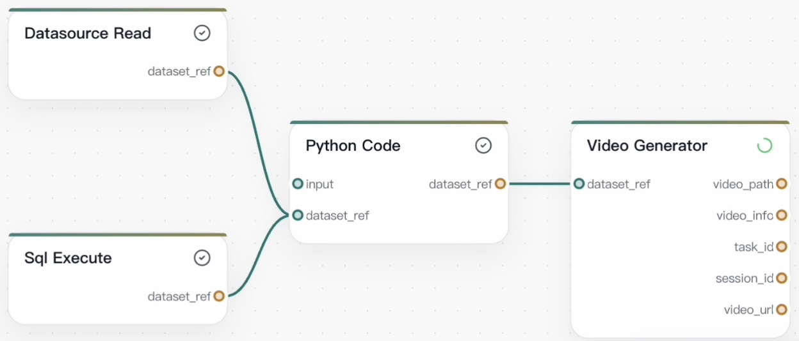
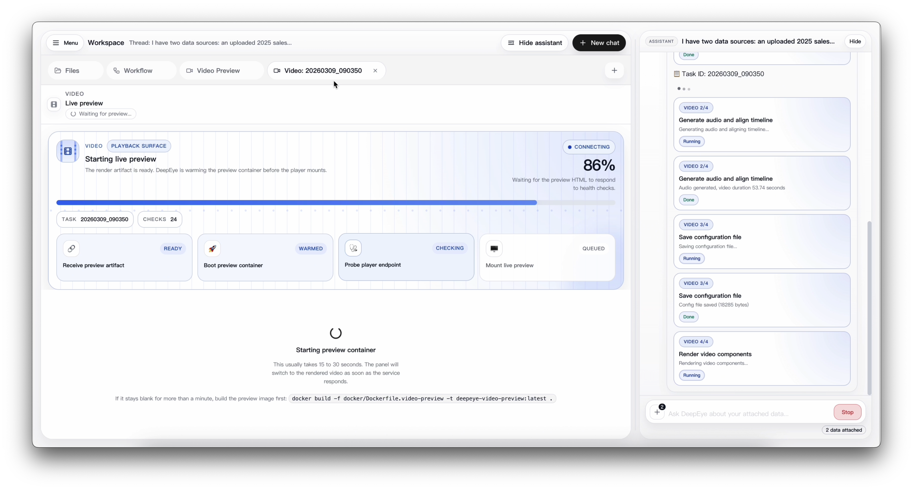
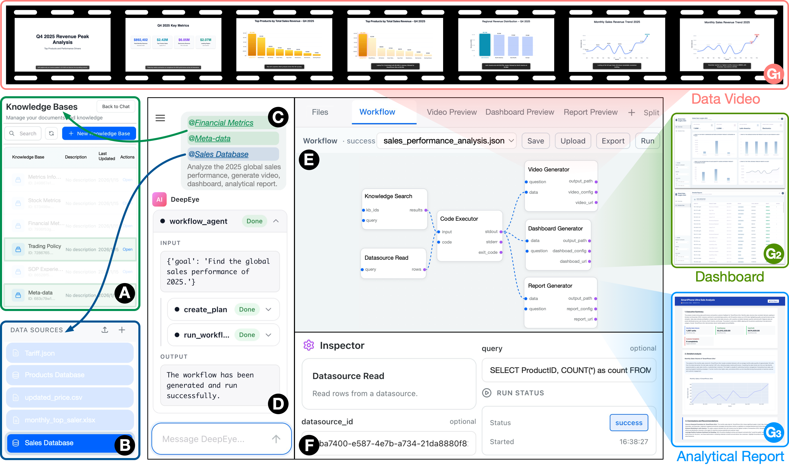

# DeepEye: A Steerable Self-driving Data Agent System

[](https://arxiv.org/abs/2603.28889)
[](https://github.com/HKUSTDial/DeepEye/actions/workflows/pytest.yml)
[](LICENSE)
[](https://doi.org/10.1145/3788853.3801612)
[](https://github.com/HKUSTDial/DeepEye)

**DeepEye** is a production-ready, steerable self-driving data agent system. Unlike linear "ChatBI" tools, DeepEye adopts a **workflow-centric architecture** that handles heterogeneous data sources and complex iterative analysis without context explosion. It autonomously orchestrates multi-step workflows to produce three classes of rich analytical artifacts:

- 🎬 **Data Videos** — narrated, animated data stories rendered from structured analysis
- 📊 **Dashboards** — interactive, live-updating visual dashboards
- 📝 **Analytical Reports** — structured, analyst-grade written reports



Key architectural advantages:
- 🔗 **Unified Multimodal Orchestration** — seamlessly integrates databases, documents, CSV/Excel files, and APIs in a single workflow
- 🧠 **Hierarchical Reasoning** — decomposes complex intents into isolated AgentNodes and deterministic ToolNodes to eliminate hallucinations
- ⚙️ **Workflow Engine** — a database-inspired execution pipeline that guarantees structural correctness and accelerates runtime through topology-aware scheduling
- 👁 **Human-in-the-loop** — transparent step-by-step execution with a live workflow inspector and runtime steering controls

---

## 🔥 News

- **[2026.05]**: DeepEye [paper](https://arxiv.org/abs/2603.28889) and [code](https://github.com/HKUSTDial/DeepEye) are released! Accepted at **SIGMOD Demo 2026**.

---

## 🖥 Demo
[](./assets/demo.mp4)

🎬 Full demo video: [assets/demo.mp4](./assets/demo.mp4)

Given heterogeneous data sources, DeepEye autonomously orchestrates a workflow and delivers Data Videos 🎬, Dashboards 📊, and Analytical Reports 📝 in one run.


---

## 🚀 Quick Start

### Prerequisites

- Docker and Docker Compose
- A supported LLM provider key and model (`LLM_API_KEY`, `LLM_BASE_URL`, `LLM_MODEL`)
- `uv` for Python development and tests
- Node.js / npm only if running the frontend outside Docker

### 1. Configure Environment

```bash
cp env.example .env
```

Open `.env` and set at minimum:

```bash
LLM_API_KEY=...
LLM_BASE_URL=...
LLM_MODEL=...
JWT_SECRET_KEY=...
POSTGRES_PASSWORD=...
MINIO_ACCESS_KEY=...
MINIO_SECRET_KEY=...
```

For shared machines, also set a unique `COMPOSE_PROJECT_NAME` and `HOST_GATEWAY_PORT` to avoid port conflicts.

### 2. Start the Stack

```bash
docker compose up --build
```

This starts Postgres, Redis, MinIO, the backend API, Celery worker, runtime-control service, frontend, and nginx gateway. Database migrations run automatically.

### 3. Open DeepEye

```
http://localhost:8080
```

> If `http://localhost:8080` is unavailable, verify your `.env` port settings (for example `HOST_GATEWAY_PORT`) and check that all Docker services are healthy with `docker compose ps`.

### 4. Stop the Stack

```bash
docker compose down
# add -v to also remove stored volumes/data
```

---

## 💡 Running Example

This walkthrough shows DeepEye completing a full sales analysis end-to-end.

### Step 1 — Connect Data Sources

In the **Data Sources** panel, add your files or databases. DeepEye supports:
- Structured: PostgreSQL / MySQL databases, CSV, Excel
- Semi-structured: JSON, XML
- Unstructured: PDF, TXT, Markdown (indexed as Knowledge Bases)

### Step 2 — Describe Your Goal in Chat

```
@Financial Metrics @Meta-data @Sales Database
Analyze the 2025 global sales performance,
generate a video, dashboard, and analytical report.
```

DeepEye automatically creates a workflow plan and asks for confirmation before running.

### Step 3 — Inspect the Workflow

The **Workflow Graph** panel renders the generated DAG, for example:



DeepEye provides node-level execution details:



Each node shows its inputs, the exact SQL queries executed, status, and outputs.

### Step 4 — Review Outputs

Outputs are rendered inline in the right panel:



Artifacts are versioned per session and can be exported or shared.

---

## 🏗 Architecture

```
session → turn → draft → run → artifact
```

DeepEye's Workflow Engine processes every draft through four stages before execution:

| Stage | Role |
|---|---|
| **Compiler** | Parses the LLM-generated workflow plan into a typed DAG |
| **Validator** | Checks node types, required parameters, and edge constraints |
| **Optimizer** | Reorders independent nodes for maximum parallel execution |
| **Executor** | Runs the DAG with isolated sandboxed code environments per node |

### Repository Layout

| Path | Purpose |
|---|---|
| [`packages/backend`](packages/backend) | FastAPI API, Celery workers, workflow orchestration, persistence, sandbox/runtime |
| [`packages/core`](packages/core) | Shared agent, datasource, workflow, graph, and sandbox primitives |
| [`packages/frontend`](packages/frontend) | React + TypeScript workspace: chat, workflow graph, artifact preview panels |
| [`docker`](docker) | Dockerfiles, nginx config, scripts, and local runtime assets |
| [`docs`](docs) | Architecture notes, RFCs, and remediation tracking |

---

## 🛠 Development

Run the full local quality gate:

```bash
make check          # run after installing deps
make check-install  # install then check
make compose-config # validate Docker Compose config
```

### Backend and Core Tests

```bash
# Default test suite
uv run pytest packages/backend/app/test packages/core/tests -q

# Docker-backed sandbox integration tests (requires Docker)
DEEPEYE_RUN_DOCKER_TESTS=1 uv run pytest \
  packages/backend/app/test/test_sandbox.py \
  packages/backend/app/test/test_sandbox_manager.py -q

# Apply migrations manually outside Compose
uv run alembic -c packages/backend/alembic.ini upgrade head
```

### Frontend

```bash
cd packages/frontend
npm install
npm run dev    # dev server
npm run build  # production build
```

---

## 🔒 Security and Deployment

DeepEye orchestrates LLM-assisted workflows with Docker-backed code execution. Treat the current stack as a **local development environment** unless you have reviewed and hardened the deployment for your threat model.

Before exposing DeepEye beyond a trusted local environment:

- Replace all example secrets and development credentials
- Review authentication, cookie, CORS, and gateway settings
- Review Docker socket access and runtime-control boundaries
- Review generated-code execution paths (reports, dashboards, video generation)
- Set resource limits and cleanup policies for your infrastructure

See [docs/security_model.md](docs/security_model.md) for details.

---

## 📚 Documentation

- [Documentation index](docs/README.md)
- [Local quickstart](docs/quickstart_local.md)
- [Workflow-native agent refactor RFC](docs/rfcs/workflow_native_agent_refactor.md)
- [Artifact protocol RFC](docs/rfcs/artifact_protocol.md)
- [Open-source remediation checklist](docs/open_source_remediation_checklist.md)

---

## 👏 Contribution

We welcome all forms of contributions. Merged PRs will be credited as contributors.

- Bug reports and feature requests: open an [Issue](https://github.com/HKUSTDial/DeepEye/issues)
- Code contributions: submit a [Pull Request](https://github.com/HKUSTDial/DeepEye/pulls)
- Please read [CONTRIBUTING.md](CONTRIBUTING.md) before submitting

---

## 🖋 Citation

If DeepEye is useful for your research or work, please cite:

```bibtex
@inproceedings{10.1145/3788853.3801612,
author = {Li, Boyan and Peng, Yiran and Xie, Yupeng and Lu, Sirong and Zhu, Yizhang and Mu, Xing and Liu, Xinyu and Luo, Yuyu},
title = {DeepEye: A Steerable Self-driving Data Agent System},
year = {2026},
isbn = {9798400724503},
publisher = {Association for Computing Machinery},
address = {New York, NY, USA},
url = {https://doi.org/10.1145/3788853.3801612},
doi = {10.1145/3788853.3801612},
booktitle = {Companion of the International Conference on Management of Data},
pages = {74–77},
numpages = {4},
location = {India},
series = {SIGMOD Companion '26}
}
```

If you have questions, feel free to open an issue.

